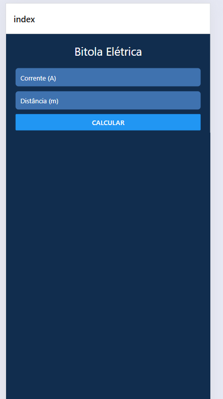

# Mobile2-ReactBit

## Contextualização

O professor de Instalações Elétricas ensina seus alunos como calcular a bitola adequada para cada uso de uma instalação. Ele solicitou que os alunos de Desenvolvimento de Sistemas criem um aplicativo que faça este cálculo automaticamente.

## Objetivo

Desenvolver um aplicativo que recebe como entrada a corrente elétrica em ampères e a distância em metros, exibindo a bitola do fio em milímetros quadrados para tensões de 110V e 220V.

## Fórmulas Utilizadas

- **Bitola para 110V:**  
  `bitola110 = (2 * corrente * distância) / 294.64`
- **Bitola para 220V:**  
  `bitola220 = (2 * corrente * distância) / 510.4`

  

## Descrição do Projeto

O aplicativo possui uma interface simples onde o usuário informa a corrente (A) e a distância (m). Ao clicar em "Calcular", o app exibe a bitola recomendada do fio para 110V e 220V, facilitando o dimensionamento correto em instalações elétricas residenciais e comerciais.

## Prints das Telas

Os prints das telas estão disponíveis na pasta [`assets`](assets/) do projeto.

## Tecnologias Utilizadas

- [React Native](https://reactnative.dev/)
- [Expo](https://expo.dev/)
- [TypeScript](https://www.typescriptlang.org/)

## Passo a Passo para Executar o Projeto

1. **Clone o repositório:**
   ```sh
   git clone <url-do-repositorio>
   cd Mobile2-ReactBit/bitola
   ```